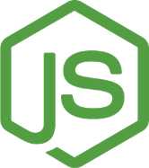
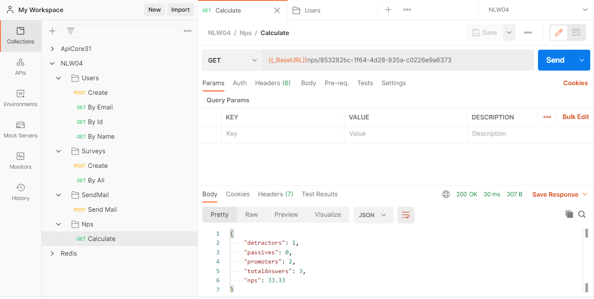

<h1 align="center">
  
</h1>

  <a href="#-tecnologias">Tecnologias</a>&nbsp;&nbsp;&nbsp;|&nbsp;&nbsp;&nbsp;
  <a href="#-projeto">Projeto</a>&nbsp;&nbsp;&nbsp;|&nbsp;&nbsp;&nbsp;
  <a href="#-como-executar">Como executar</a>&nbsp;&nbsp;&nbsp;|&nbsp;&nbsp;&nbsp;
  <a href="#-licença">Licença</a>

  

 

 

  

## ✨ Tecnologias

Esse projeto foi desenvolvido com as seguintes tecnologias:

- [React](https://reactjs.org)
- [Express](https://expressjs.com/pt-br/)
- [TypeScript](https://www.typescriptlang.org/)
- [SQLite](https://www.sqlite.org/)
- [TypeORM](https://typeorm.io/)
- [Jest](https://jestjs.io/)
- [NodeMailer](https://nodemailer.com/)
- [HandleBars](https://handlebarsjs.com/)
- [Yup](https://github.com/jquense/yup)
- [Package Supertest](https://www.npmjs.com/package/supertest)
- [Package uuid](https://github.com/uuidjs/uuid)

## 💻 Projeto

API em NodeJS e ExpressJS com intuito de criar usuários e criar pesquisas e enviá-las ou usuários.

Os email's com as pesquisas são enviadas aos usuários e nestes possuem as notas para ser dadas a cada pergunta dentro do email.

Usamos o TypeORM para mapeamento objeto-relacional. Todos os dados são salvos no SQLite. Foi usado o YUP para validação dos dados. Usamos o nodemailer para envio do email. O HandleBars foi usado para criação de template de email. Para os testes foi usado o Jest.

## 🚀 Como executar

- Clone o repositório
- Instale as dependências com `npm install`
- Inicie o servidor com `npm run dev`

Agora você pode acessar [`localhost:3000`](http://localhost:3000) do seu navegador.

## 📄 Licença

Esse projeto está sob a licença MIT. Veja o arquivo [LICENSE](LICENSE.md) para mais detalhes.

---

Feito por Douglas no NLW04 da Rocketseat ♥ 👋🏻
